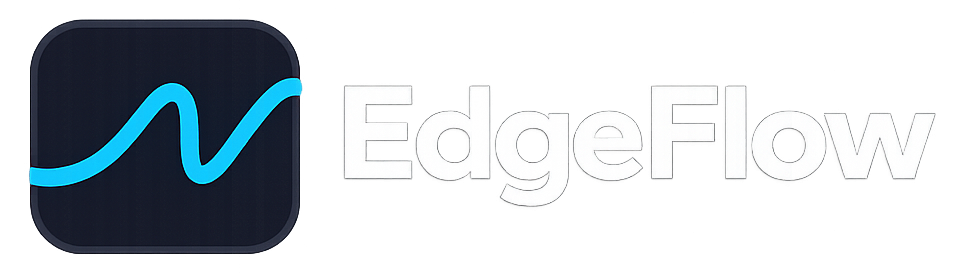

<p align="center">
  
</p>

# EdgeFlow

A JavaScript-first framework for industrial kiosks and Raspberry Pi devices. It provides flow-driven state machines, offline-first sync, hardware abstraction, and maintenance workflows—all with a developer experience comparable to modern web frameworks.

See [docs/VISION.md](docs/VISION.md) for the full vision and roadmap.

## Prerequisites

- **Node.js** >= 18
- **pnpm** (install: `npm install -g pnpm`)

## Quick start

### Option A: Create a new project (standalone)

```bash
npx create-edgeflow my-kiosk
cd my-kiosk
pnpm install
pnpm exec edgeflow dev
```

Deploy to Raspberry Pi:

```bash
pnpm exec edgeflow build
pnpm exec edgeflow deploy --host <raspberry-ip>
```

### Option B: Clone and develop (monorepo)

```bash
git clone <repo>
cd EdgeFlow
pnpm install
cp .env.example .env   # optional if defaults are fine
pnpm build
pnpm dev
```

- **Core** runs at `ws://localhost:19707` (bridge server).
- **Example kiosk** opens at `http://localhost:5173`.
- **DevTools** (debug) at `http://localhost:3001` with `pnpm dev:devtools` or `pnpm dev:all`.

Use the UI: **Start** → **Simulate QR** → **Complete**. Then open **Maintenance**, enter any token, unlock, and use **Inject serial**.

**Configuration:** single `.env` file at repo root. Copy `.env.example` to `.env` and adjust if needed (`BRIDGE_PORT`, `VITE_BRIDGE_URL`). Core and app read this file.

**Production build:** for an optimized build, use `pnpm build` then serve the generated assets. Create `.env.production` at root to inject `VITE_BRIDGE_URL` (e.g. `ws://prod-server:19707`) at build time. Vite reads `envDir` toward repo root.

**Port already in use?** `pnpm kill-ports` frees ports 19707, 19708, 5173, 5174. Or change in `.env`: `BRIDGE_PORT=19709` and `VITE_BRIDGE_URL=ws://localhost:19709`.

## Scripts

| Command        | Description                    |
|----------------|--------------------------------|
| `pnpm i`       | Install dependencies           |
| `pnpm build`   | Build all packages             |
| `pnpm dev`     | Run core + example app         |
| `pnpm dev:devtools` | Run devtools app (port 3001) |
| `pnpm dev:all` | Run core + example-kiosk + devtools |
| `pnpm dev:core` | Run core only (after build)  |
| `pnpm dev:app`  | Run example-kiosk only       |
| `pnpm cli`      | EdgeFlow CLI (dev, build, simulate, doctor, etc.) |
| `pnpm kill-ports` | Free bridge and Vite ports (19707, 19708, 5173, 5174) |
| `pnpm lint`    | Lint (ESLint)                  |
| `pnpm typecheck` | Type-check all packages     |

**CLI:** `pnpm run cli -- <cmd>` or `pnpm exec edgeflow <cmd>` after build. Commands: `init`, `dev`, `build`, `simulate`, `deploy`, `logs`, `restart`, `update`, `doctor`.

## Structure

Packages aligned with [docs/ARCHITECTURE.md](docs/ARCHITECTURE.md) §2.1:

| Package | Status | Description |
|---------|--------|-------------|
| `@edgeflowjs/core` | OK | Bootstrap, executable server (`src/run.ts`), composes bridge, flow, device, sync, maintenance, OTA |
| `@edgeflowjs/bridge` | OK | WebSocket server (Node) and client (browser), UI ↔ core protocol |
| `@edgeflowjs/flow` | OK | State machine engine (register, start, dispatch, getSnapshot, onTransition) |
| `@edgeflowjs/device` | OK | Port interfaces (GPIO, serial, network, system, identity) |
| `@edgeflowjs/device-sim` | OK | Simulator (injectSerial, setGpio, setNetworkOnline) |
| `@edgeflowjs/sync` | OK | SQLite outbox, retry, stats, `sync.outbox.updated` events |
| `@edgeflowjs/observability` | OK | Logger (createLogger) |
| `@edgeflowjs/maintenance` | OK | Unlock (token, TTL 10 min), runAction (device.testGpio, device.injectSerial, sync.retry, system.reboot, ota.check) |
| `@edgeflowjs/ota` | OK | Stub (check, apply, status events) |
| `@edgeflowjs/cli` | OK | init, dev, build, simulate, deploy, logs, restart, update, doctor |
| `create-edgeflow` | OK | Scaffold new kiosk project (npx create-edgeflow) |
| `@edgeflowjs/ui-devtools` | OK | Flow visualizer, timeline, OutboxInspector, CrashReports |
| `@edgeflowjs/ui-kit` | Planned | Kiosk components (optional) |
| `apps/example-kiosk` | OK | Vite + React: Idle → Scan → Action → ThankYou + Maintenance |

## Documentation

- **Getting started:** [docs/guides/getting-started.md](docs/guides/getting-started.md)
- **Guides:** [building a flow](docs/guides/building-a-flow.md), [bridge protocol](docs/guides/bridge-protocol.md), [deployment](docs/guides/deployment.md)
- **API reference:** [flow](docs/api/flow.md), [bridge](docs/api/bridge.md), [sync](docs/api/sync.md), [device](docs/api/device.md)
- **Reference:** [VISION](docs/VISION.md), [ARCHITECTURE](docs/ARCHITECTURE.md), [REPO](docs/REPO.md), [RFC-v1](docs/RFC-v1.md), [SYNC-DATA-MODEL](docs/SYNC-DATA-MODEL.md)

Full index: [docs/README.md](docs/README.md)

## Contributing

See [CONTRIBUTING.md](CONTRIBUTING.md) for code style, branch naming, and PR process.

## License

MIT — see [LICENSE](LICENSE).

## Tech

- pnpm workspace, TypeScript, tsup (packages), Vite (app).
- Bridge: WebSocket (`ws` on server, native `WebSocket` in browser).
- Sync: SQLite via `better-sqlite3` (in-memory fallback if native binary unavailable). On Windows, SQLite may require `npm rebuild better-sqlite3` or use WSL. Set `SYNC_STORE=memory` in `.env` to force the in-memory store and skip SQLite.
