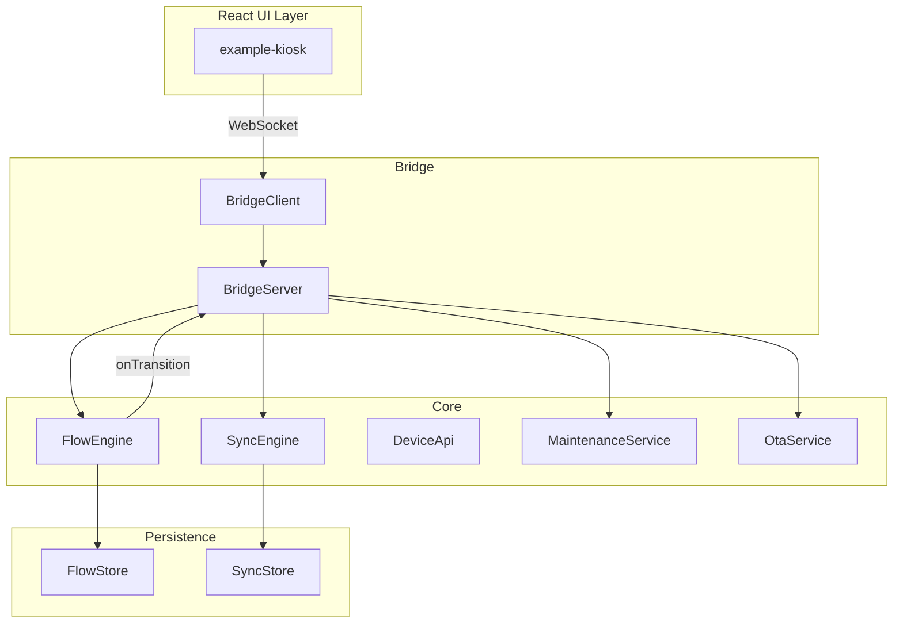

# EdgeFlow RFC v1.0 (Draft)

**Status:** Draft v1.0  
**Date:** 2025-02-27

---

## 1. Scope

EdgeFlow is a JavaScript-first SDK for building industrial kiosks and Raspberry Pi devices. It provides:

- **Offline-first** event sync with outbox pattern
- **Flow-driven** state machines for deterministic UX
- **Hardware abstraction** (GPIO, Serial, Network) with swappable adapters
- **Maintenance** workflows (QR/USB unlock, audit log)
- **OTA** updates with verification and rollback

**Target:** Node 18+, pnpm monorepo, TypeScript.

---

## 2. Architecture

**Packages:**

| Package | Role |
|---------|------|
| `@edgeflow/core` | Composition root, config, bootstrap |
| `@edgeflow/bridge` | UI ↔ core protocol (WebSocket) |
| `@edgeflow/flow` | State machines, persistence, timers |
| `@edgeflow/device` | Ports (GPIO, Serial, Network, System, Identity) |
| `@edgeflow/device-sim` | Simulator for development |
| `@edgeflow/sync` | Outbox, SQLite store, retry |
| `@edgeflow/maintenance` | Unlock, actions, audit |
| `@edgeflow/ota` | Manifest, verify, apply |
| `@edgeflow/observability` | Logger, metrics, trace |
| `@edgeflow/cli` | dev, build, simulate, deploy, doctor |

---

## 3. Public interfaces

See [REPO.md](REPO.md) for detailed TypeScript types per package.

**Key types summary:**

- **Core:** `EdgeflowPlugin`, `EdgeflowContext`, `EdgeflowApp`, `createEdgeflowApp`
- **Bridge:** `Envelope`, `BridgeRequest`, `BridgeResponse`, `BridgeEvent`, `BridgeServer`, `BridgeClient`
- **Flow:** `FlowDef`, `FlowEvent`, `FlowEngine`, `FlowStore`, `defineFlow`, `TransitionGuard`, `TransitionAction`
- **Device:** `DeviceApi`, `DeviceAdapter`, `GpioPort`, `SerialPort`, `NetworkPort`, `SystemPort`, `IdentityPort`
- **Sync:** `SyncStore`, `SyncEngine`, `OutboxEvent`, `createSqliteStore`, `createMemoryStore`
- **Maintenance:** `MaintenanceService`, `MaintenanceAuth`, `MaintenanceSession`
- **OTA:** `OtaService`, `OtaManifest`, `OtaStatus`, `verifyManifest`

---

## 4. Flow Engine API

- **Definition:** `defineFlow<TCtx>(def)` → `FlowDef<TCtx>`
- **Runtime:** `FlowEngine.register()`, `start()`, `dispatch()`, `getSnapshot()`, `onTransition()`
- **Conventions:** events in UPPER_SNAKE (e.g. `SCAN`, `TIMEOUT`, `RESET`), context `TCtx` free-form
- **Example:** Idle → Scan → Action → ThankYou → reset

See [ARCHITECTURE.md](ARCHITECTURE.md) section 4 and [SYNC-DATA-MODEL.md](SYNC-DATA-MODEL.md).

---

## 5. Sync Engine Data Model

- **MVP table:** `outbox_events` (id, type, payload, occurred_at, idempotency_key, status, retry_count, next_retry_at, last_error, trace_id)
- **Envelope:** id, type, payload, occurredAt, idempotencyKey, retryCount, status
- **Retry:** exponential backoff + jitter
- **V2 tables:** `entities_cache`, `sync_state`, `audit_log`, `crash_reports`

See [SYNC-DATA-MODEL.md](SYNC-DATA-MODEL.md).

---

## 6. CLI Architecture

| Command | Description |
|---------|-------------|
| `edgeflow dev` | Run core + app (concurrently) |
| `edgeflow build` | Build monorepo |
| `edgeflow simulate` | Run with device-sim |
| `edgeflow deploy` | Stub (flash, systemd) |
| `edgeflow logs` | Stub (tail logs) |
| `edgeflow update` | Stub (ota.check + apply) |
| `edgeflow doctor` | Validation (permissions, ports, config) |

`npx create-edgeflow-app`: scaffold (separate package or subcommand).

---

## 7. Compatibility

- **Node:** >= 18
- **Package manager:** pnpm
- **Monorepo:** pnpm-workspace
- **Build:** tsup
- **Lint:** ESLint + boundaries

---

## 8. References

- [VISION.md](VISION.md) — Product vision
- [ARCHITECTURE.md](ARCHITECTURE.md) — Module deep dive
- [REPO.md](REPO.md) — Detailed TypeScript interfaces
- [SYNC-DATA-MODEL.md](SYNC-DATA-MODEL.md) — Sync schema
